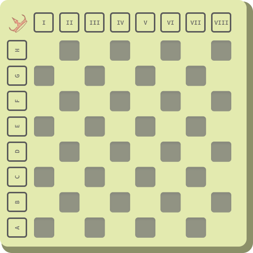
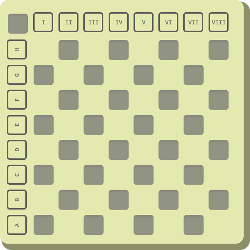
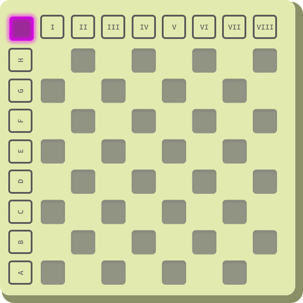
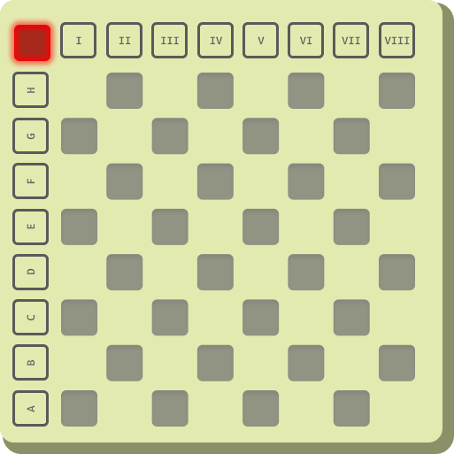

Leonardo Luz, Diego & Bruno  
4º Semestre ADS  
[Repositório](https://github.com/leonardo-luz/checkers-arduino)

---
## Sumário
1. [Descrição](#Descrição)
2. [Tecnologias](#Tecnologias)
3. [Prototipação](#Prototipação)
	1. [Tabuleiro](#Tabuleiro)
		1. [V1](#V1)
		2. [V2 Desligado](#V2Desligado)
		3. [V2 Brancos Jogam](#V2BrancosJogam)
		4. [V2 Pretos Jogam](#V2PretosJogam)
	2. [Movimentação](#Movimentação)
		1. [Peão Branco](#PeãoBranco)
		2. [Peão Preto](#PeãoPreto)
		3. [Rei Qualquer](#ReiQualquer)

---
### Descrição
> &ensp;O projeto visa desenvolver um tabuleiro de damas que não utilize peças, tendo como principal agente para este fator o arduino. Serão utilizados 32 leds rgb e estes representarão coisas diferentes de acordo com a sua situação sendo:  
> &emsp;Desligado uma posição desocupada,  
> &emsp;Amarelo uma peça do time 'braco',  
> &emsp;Vermelho uma peça do time 'preto' e  
> &emsp;Verde uma possivel movimentação.  
> &ensp;Também serão utilizados 16 botões ao redor do tabuleiro reperesentando um plano cartesiano, tendo 8 botões indo de 1 a 8 e o restante indo de 'A' a 'H'. Os botões serão utilizados para movimentar as peçãs, com os númerados representando o vetor 'X' e os alfabéticos representando o vetor 'Y'.

---
### Tecnologias

- Arduino Mega
- 32x LEDs RGB
- 16x Botões
- 4x shift registers
- Linguagem C++

---

### Prototipação

> As cores representadas são meramente ilustrativas e provavelemnte serão modificadas ao decorrer do projeto

> Trocar o icone da coroa por um led que sinalize qual jogador esta jogando.

#### Tabuleiro
##### V1

##### V2 Desligado

##### V2 Brancos Jogam

##### V2 Pretos Jogam

#### Movimentação
##### Peão Branco

##### Peão Preto

##### Rei Qualquer

---
